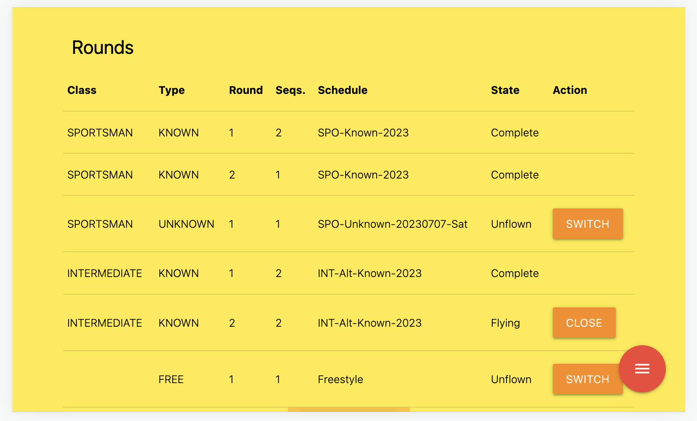

Development
========================

Under this section the development aspects will be documented.
Things like how to compile the code and design decisions etc.

Applicaton Flow Ideas
---------------------

Right now the application stores a "next round number" per pilot.   This schema will need to change because you can have different round numbers for different types of rounds.   It's not such a problem for Knowns/Unknowns but for freestyle it will be an issue.

For example, lest say you score 1 round of Sportsman, Intermediate and Advanced.   For pilots in these classes the 'next round' will be round 2.   You break for lunch and decide to run a freestyle round while people are eating.

For those pilots in Unlimited flying Freestyle, this will be their 'round 1' but it's 'round 2' for the others.
After lunch you have more problems because now some sportsman pilots are up to 'round 3' and some are only at round 2 because they did not fly freestyle.  The solution is to maintain round numbers per class and per type (and freestyle separately as well).

Currently, each time you choose a pilot you have to select the round type. 
So here is an opportunity for the judge to screw it up and cause lots of headaches for the CD.   If he accidentally chooses known instead of unknown he's caused a problem.

Here is my proposal on how the flow can happen that will hopefully solve problem 1 and minimize problem 2.

**Scenario 1 - Filter pilots per round.**

* Only one round can be flown at a time (per flightline)
* Rounds are defined giving round numbers, sequence count and schedule. |roundImg1|
* Any of the rounds can be chosen as the 'current round' and you can stop and start rounds mid-stream buy simply selecting another round to fly.
* Rounds that are completed cannot be reflown. |roundImg2|
* Extra rounds can be added and it's not a problem when rounds are not flown - it makes no different to the results.

.. |roundImg1| image:: images/001.png
    :width: 90%
    :align: middle

When a round is being flown, the pilots are filtered so you only see pilots participating in this round.   And the round number and sequence information is of course taken from the active round, not from the pilots record.

**Scenario 2 - All pilots are available.**

So how can we have this work for smaller comps where we just want everything to fly - as they do now?   I believe this can be achieved with a small change to the code.
Rounds are still defined but when you choose a pilot, if he is the first pilot in this class to fly the current round, you then choose Known, Unknown or Freestyle.

Selecting a round won't be necessary and they pilots won't be filtered.

So when the application state shows that the current class does not have an active flight, and you choose a pilot from that class, then you are asked:
* Is it a known or unknown?
* What schedule is it?
* Is it a single or a double?

A new round is 'defined' and saved.   Since we are in 'unfiltered' mode, then there is no need to mark the round as active.   That is done automatically.

The pilot flies, you score it, and you move on to the next pilot.   One of three things happens.

#. **You choose a pilot from the same class who has not flown this round.** 
    When this happens you are simply allowed to score the round as usual.
#. **You choose a pilot from the same class who has already flown this round.**
    When this happens, you are shown that the scores exist and can choose another pilot.
#. **You choose a pilot from another class.**
    If there is not a round active for this class, then you are prompted to choose one as described above.   If there is a round active, then you just score according to that round.

In this scenario I'm not sure how we do freestyle.    I think the only solution there is to ignore it, but when a freestyle round should be scored, the CD will simply set the freestyle round to the the 'active' round and turn on 'filtering mode'.
Then for that round the judges will only see freestyle pilots and have the freestyle schedule.

In both of these scenarios we are still relying on the judge to 'pick the right round'.  Scenario one gives him the opportunity to pick a lot of things but it's quite easy to go back and reselect a round when he realises his mistake.   If he has chosen known instead of unknown *and* the known is a single sequence round *and* he's not looking at the figures or using the sound, then he might make it through to the end and cause a lot of headache for the CD, but it should be fixable.

In the second scenario, it's easy as well to select the wrong type (known or unknown) and so the same danger applies.

One way to get around this is for the devices to communicate with each other.  I've thought about how to solve this with ScorePad in the past and have come up with the following idea:
* Judge selects the round and clicks OK.
* Device advertises on the local network "I am judge X of Flight Line Y.   I am scoring Sportsman Known Round 1".
* Device does not start scoring until it hears from every other judge device.    It only needs to know how many devices there should be and that can be provided by Score.

