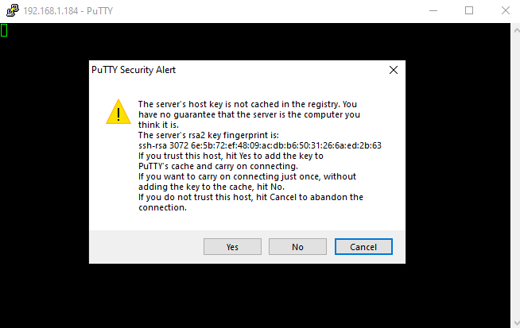
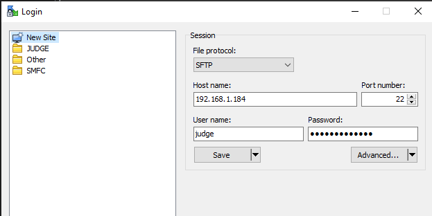
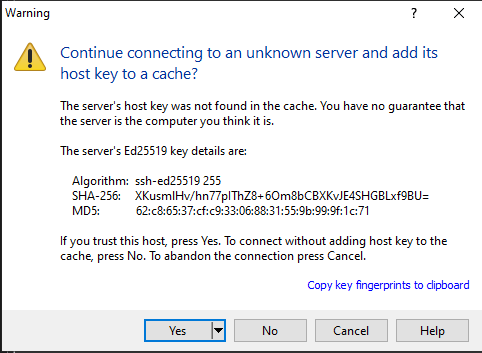
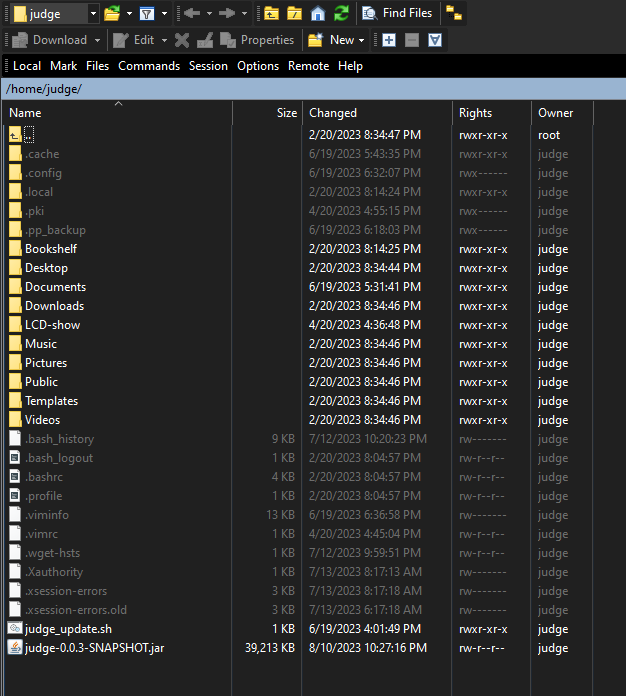

AeroJudge Device Setup
======================

Setup New device
----------------

If you have a new device or a new SD card, then you need to download the full device image:

1. download image here
2. Use pi imager to write image to SD card
   
   * Win32 Disk Imager https://sourceforge.net/projects/win32diskimager
   * balenaEtcher https://www.balena.io/etcher
   * Raspberry Pi Imager https://www.raspberrypi.com/software/
 
3. Once the pi image is written, a drive letter will be assigned (in Windows)
4. Continue to Configuring device for a contest

Updating the device
-------------------

If you have an existing device that needs to be updated:

* If the device is connected to WiFi network with internet available:

  1. Login to the device using putty entering the appropriate IP address |LoginImg1|

  2. Answer Yes if you receive a security alert (only the first time) |LoginImg2|

  3. At login as prompt enter "judge" and press enter.

  4. At the password prompt enter the approprate password. Contact the IMAC AeroJudge development team for the current password.
       .. note:: When typing the password no characters will be displayed on the screen. If a mistake is made, press Enter and it will prompt again to enter the correct password.

     |LoginImg3|

  5. Run update command: 

     .. code-block:: bash

         ./judge_update.sh

.. |LoginImg1| image:: images/adv001.png
    :align: middle

.. |LoginImg3| image:: images/adv003.png
    :align: middle

* If the device is not connected to a WiFi network with internet, but you have the ability to obtain (or previously obtained) the latest judge application:

  #. Use `WinSCP <https://winscp.net/>`_ (or similar FTP application) to transfer the new application file to the device |UpdateImg1|
  #. Answer Yes if you receive a security alert (only the first time) |UpdateImg2|
  #. Navigate to the location with the updated application, click on the file and drag it to the device folder: |UpdateImg3|
  #. The file should now appear on the device: |UpdateImg4|

  #. Login to the device with Putty (or in WInSCP use menu :menuselection: `Commands --> Open Terminal` ) and run the following commands in order:

     .. code-block:: bash

        sudo systemctl stop kiosk.service
        sudo systemctl stop judge.service
        mv {filename you transferred} /var/opt/judge/bin/judge.jar
        sudo systemctl start kiosk.service
        sudo systemctl start judge.service

    .. note:: No response will be seen after the commands are run

    |UpdateImg5|

.. |UpdateImg3| image:: images/devupd003.png
    :align: middle

.. |UpdateImg5| image:: images/devupd005.png
    :align: middle

Configuring device for a contest
--------------------------------

1. Insert SD card, opening the result drive, and find the file named settings.json. 

2. Open this file in a standard text editor (not a rich editor like MS Word).

3. Edit the file placing the appropriate values after the colon (:) being careful to preserve all formatting (braces, quotes, commas).

   .. code-block:: javascript

      {
        "judge_id":1,
        "line_number":1,
        "score_host":"192.168.50.100",
        "score_http_port":80,
        "language":"en"
      }

 *settings.json file parameters:*

  **line_number** is a single integer number starting at 1. Each AeroJudge device for a given flight line should have the same number. A different flight line should have the next highest integer number (eg 2) for all devices being used on that line.

  **judge_id** is a single integer number starting at 1. Each AeroJudge device for a given flight line should have a different judge id from 2 (minimum) to the number of judges for that line.

  **score_host** is the network IP address of the computer running the Score software with services running

  **score_http_port** is the port number entered on the Score software services tab

  **language** is the two letter language code (currently only "en" is supported)

4. Be sure to eject the disk properly (right-click drive letter and choose Eject)

5. Insert the SD card back into the device and power the device